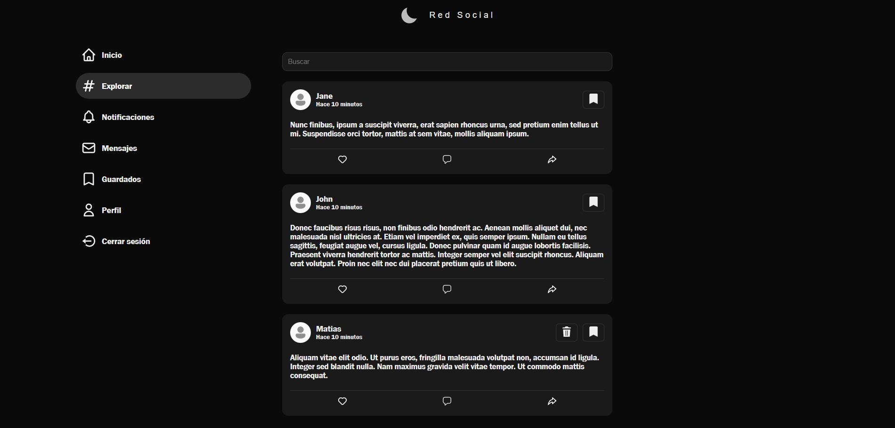
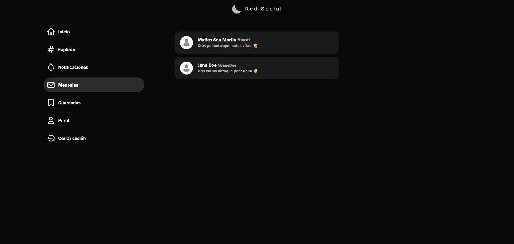

# Proyecto "Red Social"
Proyecto de estilo red social desarrollado con el stack de desarrollo MERN (MongoDB, Express, React y Node.js). Este proyecto es una aplicación web que permite:
- Registro de usuarios
- Inicio de sesión
- Publicación de contenido
- Comentarios en publicaciones
- Exploración de publicaciones
- Mensajería entre usuarios
## Caracteristicas
- Autenticación de usuarios con JWT
- Feed de publicaciones con likes, comentarios y compartidos.
- Seccion de exploración para descubrir nuevas publicaciones.
- Chat en tiempo real entre usuarios a traves de WebSockets.
- Perfil de usuario con información personal y publicaciones.
- Responsivo y amigable para dispositivos móviles.

## Tecnologías
- **Frontend:** Next.js, React, Tailwind CSS, React Query
- **Backend:** Node.js, Express, MongoDB, Mongoose
- **Autenticación:** JWT
- **Estado y datos:** Redux Toolkit, React Query
- **Otros:** Socket.io para chat en tiempo real, Axios

## Instalación
1. Clonar repositorio
2. Instalar dependencias tanto en  RedSocial/backend como en el RedSocial/frontend:
   ```bash
   npm install
   ```
3. Configurar variables de entorno en el archivo `.env` en la carpeta `backend/src/config`:
   ```plaintext
    PORT=3001
    DB_URL=mongodb+srv://<usuario>:<contraseña>@cluster.mongodb.net/<nombre_base_datos>?retryWrites=true&w=majority
    URL_FRONTEND=http://localhost:3000
    ACCESS_TOKEN_SECRET=tu_secreto_jwt
    REFRESH_TOKEN_SECRET=tu_secreto_jwt

# Pre-visualizacion
## Página de inicio de sesion

## Página de inicio/feed de publicaciones

## Seccion de comentarios de publicacion

## Páginas de seccion explorar

## Página de perfil de usuario

## Página de seccion de mensajes



